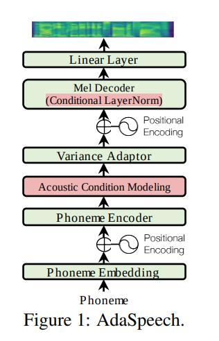
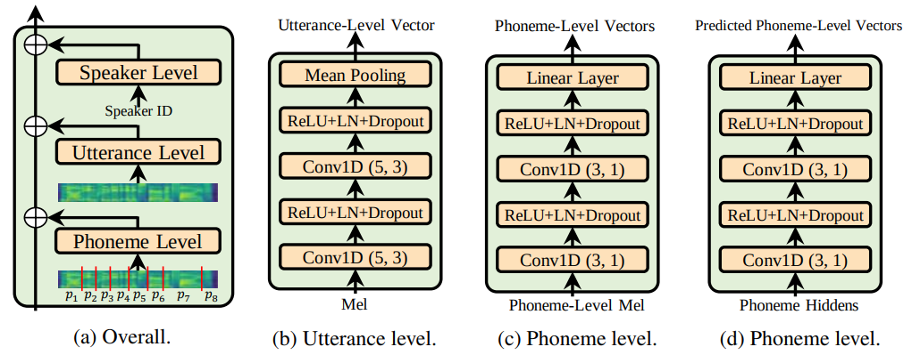

# Persian-AdaSpeech

This is an adaptation of [**AdaSpeech**](https://arxiv.org/pdf/2103.00993) trained on Persian data. **AdaSpeech** is a custom adaptive TTS model that produces high-quality speech with voice adaptation capabilities. This version is specifically adapted to handle the unique phonetic characteristics of the Persian language. The original model and codebase can be found in [FastSpeech2 implementation](https://github.com/ming024/FastSpeech2) and further references are included below.

## Key Features

- **Support for Persian Language**: Custom preprocessing and training on Persian phonemes and speech datasets.
- **Utterance Level Encoder** and **Phoneme Level Encoder** for better acoustic generalization across speakers.
- **Conditional Layer Norm (CLN)**, a core feature of the AdaSpeech paper, enhances adaptability in voice synthesis.

## References
- [AdaSpeech: Adaptive text to speech for custom voice](https://arxiv.org/pdf/2103.00993.pdf).
- [ming024's implementation](https://github.com/ming024/FastSpeech2)
- [rishikksh20's AdaSpeech implementation](https://github.com/rishikksh20/AdaSpeech)

## License  
This repository is based on [AdaSpeech](https://github.com/rishikksh20/AdaSpeech), which is licensed under the [Apache License 2.0](http://www.apache.org/licenses/LICENSE-2.0).  
The modifications made by Majid Adibian are licensed under the Apache License 2.0 as well.
